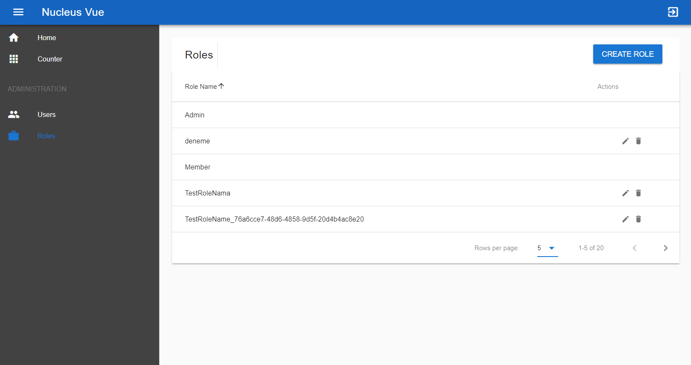

# Nucleus

Web API startup template with a Vue Client demo.

## How to Start?

- Select `Nucleus.Web.Api` project "**Set as Startup Project**" 
- Open "**Package Manager Console**" and select default project as `src/Nucleus.EntityFramework`
- Run `update-database` command to create database.
- Run(F5 or CTRL+F5) Web API project first 
- Run `yarn` command at location `src/Nucleus.Web.Vue` to install npm packages.
- Run `yarn serve` command to run Vue application.
- Admin user name and password : `admin/123qwe`

## Vue Client Demo

### Login Page

### Register Page

### List Pages

### Create/Edit Pages

## ASP.NET Core Web API 

### Project solution:

### Swagger UI

### Tags & Technologies

- ASP.NET Core Web API
- Entity Framework Core
- ASP.NET Core Identity
- JWT (Bearer Token) Based Authentication
- Automapper
- Serilog
- Swagger
- ASP.NET Core Test Host
- Authorization & Authentication
- Exception Handling & Logging
- Vue
- Vue Router
- Microsoft.CodeCoverage
- Vuetify
