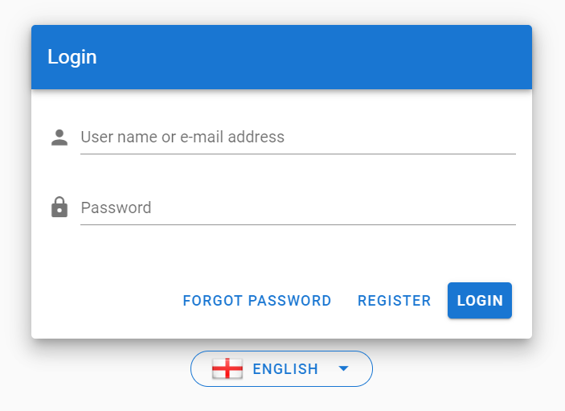
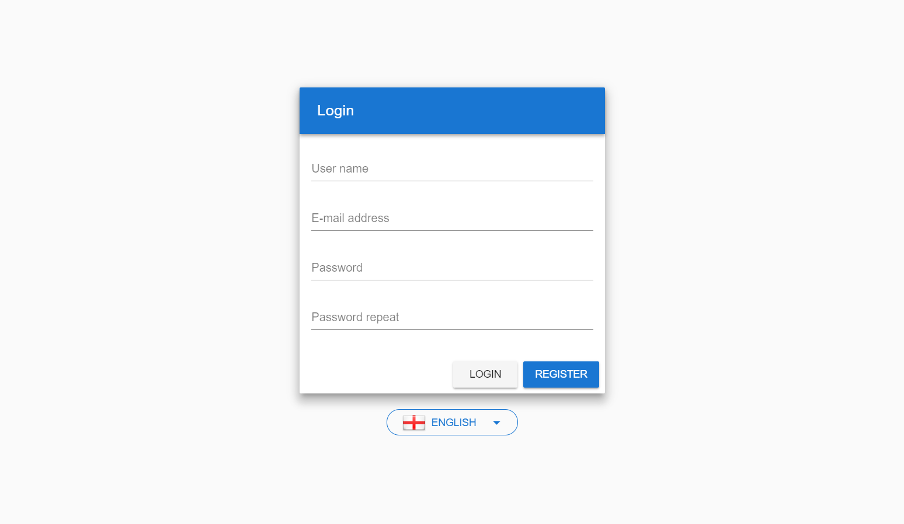
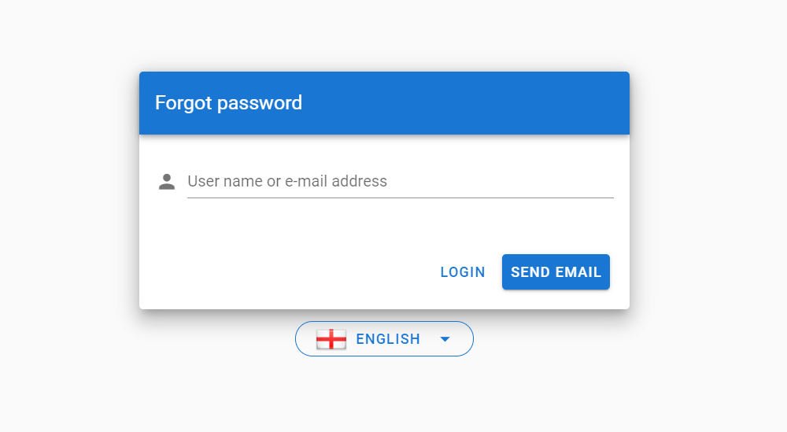
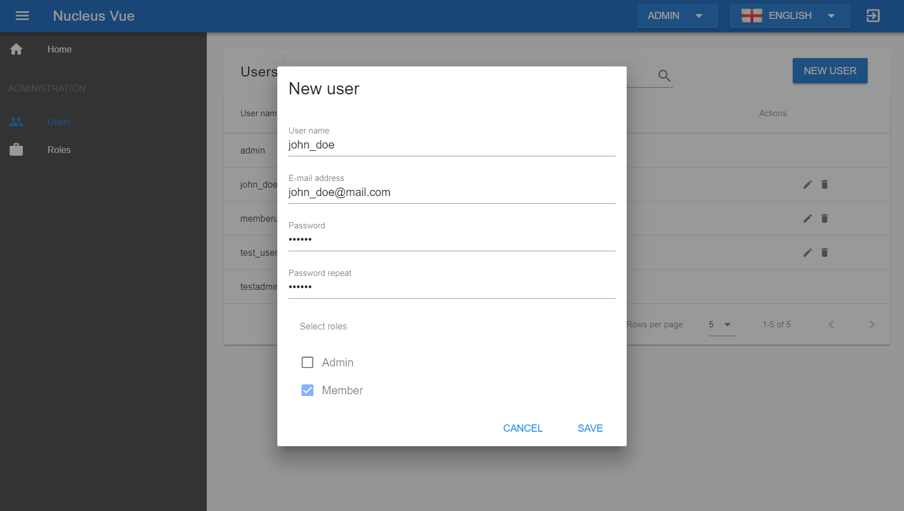
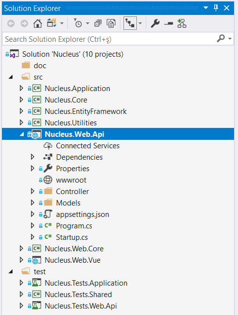
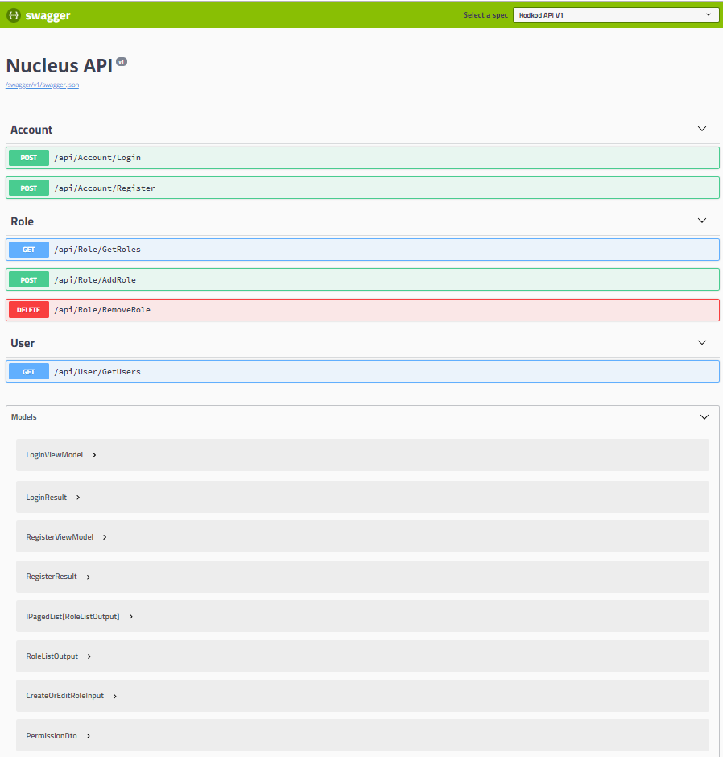

# Nucleus

Web API startup template with a Vue Client application.

<br/>
<br/>

## Requirements

- Vue CLI v3.x or later.
- Nodejs v10.x or later.
- Visual Studio 2019 v16.3 or later **for Windows**.
- Visual Studio 2019 for Mac v8.3 or later **for macOS**.

## How to Start?

- Select `Nucleus.Web.Api` project "**Set as Startup Project**" 
- Open "**Package Manager Console**" and select default project as `src/Nucleus.EntityFramework`
- Run `update-database` command to create database.
- Run(F5 or CTRL+F5) Web API project first 
- Run `yarn` command at location `src/Nucleus.Web.Vue` to install npm packages.
- Run `yarn serve` command to run Vue application.
- Admin user name and password : `admin/123qwe`

**NOTE:** Tests are using database connection, so you can create a different database for tests. And you can type this database connection string to `appsettings.json` in `Nucleus.Tests.Shared`. Now your test project will use different database than live database.

## Vue Application Screenshots

### Login Page



### Register Page



### Forgot Password Page



### List Pages


### Create/Edit Pages



## ASP.NET Core Web API

### Project solution:



### Swagger UI



# Document

## Swagger UI Authorize

You can login on swagger ui by using a bearer token. So you can make requests to authorized end-points. Check the following steps.

- In swagger ui, execute `api/login` to get a bearer token.
- Copy bearer token that is in `api/login` response.
- Click `Authorize` button in swagger ui page.
- Enter the token like `Bearer <token>` and click `Authorize`.
- Now you can make requests to authorized end-points.

## Adding New Language

- Add json file to store language keys and values to `Nucleus\src\Nucleus.Web.Vue\src\assets\localizations\your_language.json`
- Copy `en.json` content and translate the values to target language.
- Add country flag to `Nucleus.Web.Vue\src\assets\images\icons\flags\your_country.png`. Get images from http://www.iconarchive.com/show/flag-icons-by-gosquared.html
- Add language to language selection menu in `Nucleus\src\Nucleus.Web.Vue\src\account\account-layout.vue` and `Nucleus\src\Nucleus.Web.Vue\src\admin\components\menu\top-menu\top-menu.vue` like following

**account-layout.vue**

````html
<v-menu>
    <template v-slot:activator="{ on }">
        <v-btn color="primary" dark outlined rounded v-on="on">
            
            {{selectedLanguage.languageName}}
        <v-icon dark class="ml-3">mdi-menu-down</v-icon>
        </v-btn>
    </template>

    <v-list>
        <v-list-item @click="changeLanguage('en', 'English')">
            
            <v-list-item-title>English</v-list-item-title>
        </v-list-item>
        <v-list-item @click="changeLanguage('tr', 'Türkçe')">
            
            <v-list-item-title>Türkçe</v-list-item-title>
        </v-list-item>
    </v-list>
</v-menu>
````

**top-menu.vue**

````html
<v-menu>
    <template v-slot:activator="{ on }">
        <v-btn color="primary" v-on="on">
            
            {{selectedLanguage.languageName}}
            <v-icon dark class="ml-3">mdi-menu-down</v-icon>
        </v-btn>
    </template>

    <v-list>
        <v-list-item @click="changeLanguage('en', 'English')">
            
            <v-list-item-title>English</v-list-item-title>
        </v-list-item>
        <v-list-item @click="changeLanguage('tr', 'Türkçe')">
            
            <v-list-item-title>Türkçe</v-list-item-title>
        </v-list-item>
    </v-list>
</v-menu>
````

###

### Tags & Technologies

- [ASP.NET Core Web API](https://docs.microsoft.com/en-us/aspnet/core/web-api/?view=aspnetcore-2.1)
- [Entity Framework Core](https://docs.microsoft.com/en-us/ef/core/)
- [ASP.NET Core Identity](https://docs.microsoft.com/en-us/dotnet/api/microsoft.aspnetcore.identity?view=aspnetcore-2.1)
- [JWT (Bearer Token) Based Authentication](https://www.nuget.org/packages/Microsoft.AspNetCore.Authentication.JwtBearer/)
- [Automapper](https://automapper.org/)
- [Serilog](https://serilog.net/)
- [Swagger](https://swagger.io/)
- [ASP.NET Core Test Host](https://www.nuget.org/packages/Microsoft.AspNetCore.TestHost)
- [Authorization & Authentication](https://docs.microsoft.com/en-us/aspnet/core/security/?view=aspnetcore-2.1)
- [Exception Handling & Logging](https://docs.microsoft.com/en-us/aspnet/core/fundamentals/error-handling?view=aspnetcore-2.1)
- [Vue.js](https://vuejs.org/)
- [Vue Router](https://router.vuejs.org/)
- [Vuetify](https://vuetifyjs.com/en/)
- [Vue i18n](https://kazupon.github.io/vue-i18n/)

## Lincense

[MIT License](https://github.com/alirizaadiyahsi/Nucleus/blob/dev/LICENSE)
